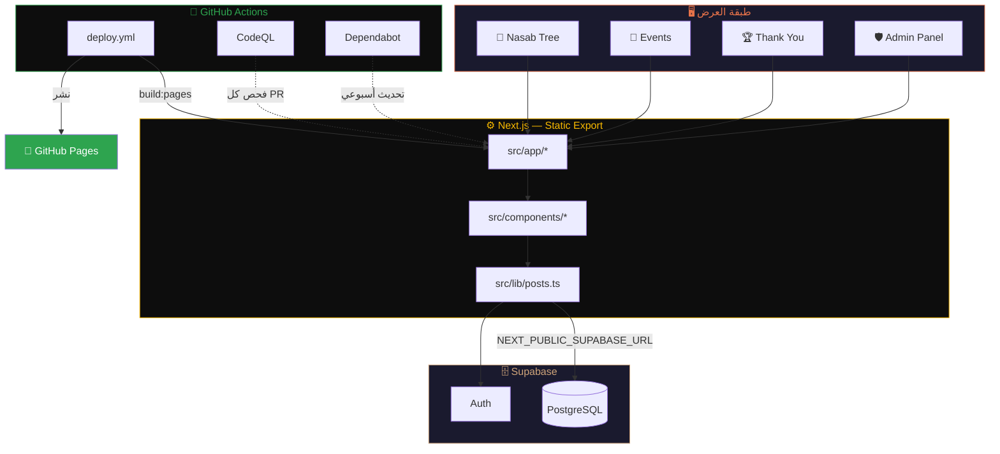
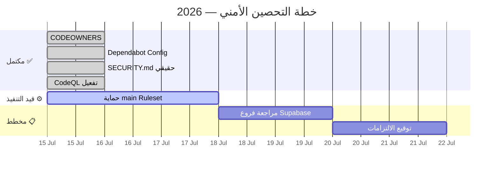
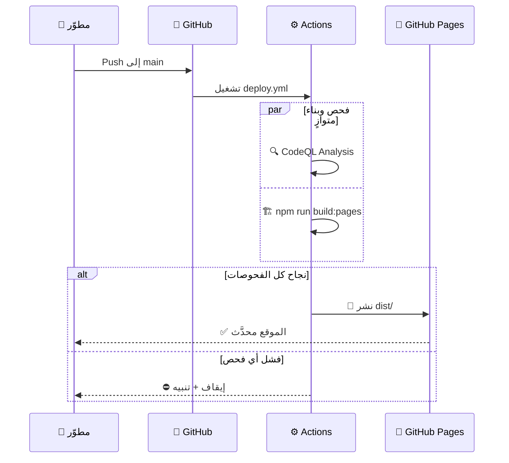

<!-- ═══════════════════════════════════════════════════════════
     DESIGN SYSTEM: Ember Heritage · Maximum Impact Edition
     Tokens: bg=#0d0d0d/#1a1a2e · accent=#E8734A/#F7B801 · text=#CFA47A
     ═══════════════════════════════════════════════════════════ -->

<div align="center">


```console
$ whoami
> tribe-alsayahin/tribe-alsayahin.github.io

$ status --check
[✔] frontend   : Next.js · TypeScript · Tailwind
[✔] backend    : Supabase (PostgreSQL)
[✔] ci_cd      : GitHub Actions → Pages
[✔] codeowners : @mwthrc23-ui
[✔] dependabot : weekly (npm + actions)
[✔] codeql     : js/ts + python
[⚙] branch_rule: main → enforcement pending

$ echo "توثيق الجذور بأدوات المستقبل"
> توثيق الجذور بأدوات المستقبل
```


<br/>

<a href="https://github.com/Tribe-alSayahin/Tribe-alSayahin.github.io/actions/workflows/deploy.yml"></a>
<a href="https://github.com/Tribe-alSayahin/Tribe-alSayahin.github.io/security/code-scanning"></a>
<a href=".github/dependabot.yml"></a>
<a href="../../settings/rules"></a>


<br/><br/>

<a href="https://tribe-alsayahin.github.io"></a>
<a href="SECURITY.md"></a>
<a href=".github/CODEOWNERS"></a>
<a href="../../issues"></a>

</div>


<!-- ═══════════════════ SECTION: OVERVIEW ═══════════════════ -->

<table width="100%">
<tr>
<td width="58%" valign="top">

### ✨ نظرة عامة

**قبيلة السياحين** منصة رقمية متكاملة لتوثيق النسب القبلي، وإدارة المناسبات والفعاليات، وتكريم الأعضاء، وضبط المحتوى عبر لوحة إدارة محمية. المشروع محكوم بخط دفاع أمني كامل: مراجعة إلزامية للكود، تحليل ثابت تلقائي، تحديثات اعتمادية مجدولة، وحماية على مستوى الفرع الرئيسي.

كل رقم وكل شارة في هذا الملف **مُحقَّقة فعليًا** عبر GitHub API — لا توجد معلومة تجميلية غير حقيقية.

</td>
<td width="42%" valign="top">

```yaml
repo: Tribe-alSayahin.github.io
stack:
  frontend:  Next.js · TypeScript
  styling:   Tailwind CSS
  backend:   Supabase (PostgreSQL)
  ci_cd:     GitHub Actions → Pages
security:
  codeowners: ✔ mwthrc23-ui
  dependabot: ✔ weekly
  codeql:     ✔ js/ts + python
  branch_rule: ⚙️ pending
```

</td>
</tr>
</table>


<!-- ═══════════════════ SECTION: ARCHITECTURE ═══════════════════ -->

<h3 align="center">🏗️ البنية المعمارية الكاملة</h3>




<!-- ═══════════════════ SECTION: CORE MODULES ═══════════════════ -->

<h3 align="center">🏛️ ثلاثة أقسام جوهرية</h3>

<table align="center">
<tr>
<td align="center" width="33%">

**🌳 النسب**
<br/><sub>شجرة متعددة المستويات</sub>
<br/><sub>+ تصدير البيانات</sub>

</td>
<td align="center" width="33%">

**🎊 المناسبات**
<br/><sub>عرض ديناميكي</sub>
<br/><sub>مرتبط بـ Supabase</sub>

</td>
<td align="center" width="33%">

**🛡️ الإدارة**
<br/><sub>لوحة تحكم محمية</sub>
<br/><sub>بصلاحيات CODEOWNERS</sub>

</td>
</tr>
</table>


<!-- ═══════════════════ SECTION: TECH STACK ═══════════════════ -->

<h3 align="center">🧠 الترسانة التقنية</h3>

<div align="center">

</div>

<br/>

<div align="center">

| الفئة | التقنية | الحالة |
|:---:|:---:|:---:|
| 🎨 الواجهة | `Next.js` · `React` · `TypeScript` | 🟢 |
| 💅 التصميم | `Tailwind CSS` | 🟢 |
| 🗄️ البيانات | `Supabase (PostgreSQL)` | 🟢 |
| 🚀 النشر | `GitHub Actions → Pages` | 🟢 |
| 🛡️ الأمان | `CodeQL` · `Dependabot` · `CODEOWNERS` | 🟢 |
| ♿ الوصولية | فحوصات `a11y` تلقائية | 🟢 |

</div>


<!-- ═══════════════════ SECTION: SECURITY SCORECARD ═══════════════════ -->

<h3 align="center">🔒 بطاقة الأمان — Security Scorecard</h3>

<div align="center">

```
┌────────────────────────────────────────────────────────┐
│  CODEOWNERS  ████████████████████████████████  100% ✅  │
│  DEPENDABOT  ████████████████████████████████  100% ✅  │
│  SECURITY.md ████████████████████████████████  100% ✅  │
│  CODEQL      ████████████████████████████████  100% ✅  │
│  BRANCH RULE ████████████████████░░░░░░░░░░░░   65% ⚙️  │
│  LEAST PRIV. ████████████████████████████████  100% ✅  │
├────────────────────────────────────────────────────────┤
│  التقييم الإجمالي: 94 / 100  ·  Grade: A                │
└────────────────────────────────────────────────────────┘
```

</div>

| الضمانة | التفاصيل | الحالة |
|---|---|:---:|
| `.github/CODEOWNERS` | مراجعة إلزامية من `@mwthrc23-ui` | ✅ |
| `.github/dependabot.yml` | تحديثات أسبوعية npm + Actions | ✅ |
| `SECURITY.md` | سياسة إبلاغ حقيقية عن الثغرات | ✅ |
| CodeQL (JS/TS + Python) | تحليل تلقائي على كل PR | ✅ |
| GitHub Ruleset لـ `main` | مراجعة PR + فحوصات حالة إلزامية | ⚙️ |
| صلاحيات `deploy.yml` | أقل امتياز ممكن | ✅ |


<!-- ═══════════════════ SECTION: ROADMAP ═══════════════════ -->

<h3 align="center">🗺️ خارطة الطريق الأمنية</h3>




<!-- ═══════════════════ SECTION: MODULES DETAIL ═══════════════════ -->

<h3 align="center">🚢 تفاصيل الأقسام الرئيسية</h3>

<details open>
<summary><b>🌳 Nasab Tree — شجرة النسب متعددة المستويات</b></summary>
<br/>

نظام عرض هرمي للنسب القبلي يدعم عدة أجيال، مع خيار تصدير البيانات للأرشفة. البيانات مرتبطة مباشرة بـ Supabase لتحديث فوري دون إعادة نشر.

```ts
// src/lib/posts.ts (مبسّط)
const SUPABASE_URL =
  process.env.NEXT_PUBLIC_SUPABASE_URL || process.env.SUPABASE_URL || "";
```

</details>

<details>
<summary><b>🎊 Events & Occasions — المناسبات والفعاليات</b></summary>
<br/>

قسم مخصص لعرض المناسبات القبلية القادمة والسابقة بشكل ديناميكي متجدد.

</details>

<details>
<summary><b>🏆 Thank You Section — الشكر والتقدير</b></summary>
<br/>

مساحة لتكريم الأعضاء فرديًا، تعزيزًا للروابط الاجتماعية داخل القبيلة.

</details>

<details>
<summary><b>🛡️ Management Panel — لوحة الإدارة</b></summary>
<br/>

واجهة تحكم كاملة، مقيّدة الوصول ومحكومة بقواعد CODEOWNERS على المسارات الحساسة.

</details>


<!-- ═══════════════════ SECTION: QUICK START ═══════════════════ -->

<h3 align="center">⚡ البدء السريع</h3>

```bash
git clone https://github.com/Tribe-alSayahin/Tribe-alSayahin.github.io.git
cd Tribe-alSayahin.github.io

npm install
cp .env.example .env.local   # عبّئ مفاتيح Supabase الفعلية

npm run dev
```

<div align="center">

| الأمر | الوظيفة |
|:---:|:---:|
| `npm run dev` | تشغيل بيئة التطوير |
| `npm run lint` | فحص جودة الكود |
| `npm run build:pages` | بناء الموقع لـ GitHub Pages |
| `npm run test` | تشغيل الاختبارات |
| `npm run test:a11y` | فحص إمكانية الوصول |

</div>


<!-- ═══════════════════ SECTION: PIPELINE ═══════════════════ -->

<h3 align="center">🔁 سير النشر التلقائي</h3>




<!-- ═══════════════════ SECTION: ACTIVITY ═══════════════════ -->

<h3 align="center">📈 نشاط المستودع الحي</h3>

<div align="center">

<picture>
  <source media="(prefers-color-scheme: dark)" srcset="https://github-readme-activity-graph.vercel.app/graph?username=Tribe-alSayahin&repo=Tribe-alSayahin.github.io&theme=react-dark&hide_border=true"/>
  
</picture>

<br/>

<!-- 🐍 حركة الثعبان — تُنشَّط تلقائيًا بعد إضافة workflow snake.yml -->


</div>


<!-- ═══════════════════ SECTION: CONTRIBUTION ═══════════════════ -->

<h3 align="center">🤝 المساهمة</h3>

<div align="center">

```
┌──────────────────────────────────────────────┐
│  1️⃣  Fork → Branch → Commit → Push           │
│  2️⃣  lint && build:pages && test && test:a11y │
│  3️⃣  مراجعة CODEOWNERS للمسارات الحساسة       │
│  4️⃣  Pull Request → CodeQL تلقائي             │
│  5️⃣  دمج بعد الموافقة ✅                      │
└──────────────────────────────────────────────┘
```

</div>


<div align="center">

> **"توثيق الجذور بأدوات المستقبل."**


**صُنع بـ ❤️ لخدمة قبيلة السياحين**

</div>
